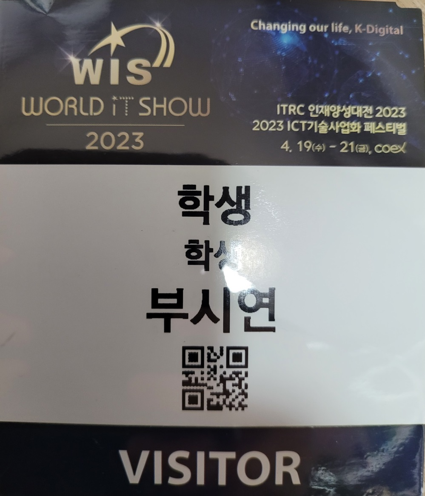

# World IT 전시회 2023 후기

## [World IT 전시회 2023](https://www.worlditshow.co.kr/main/main.php)

## [World IT 전시회 2023 유튜브](https://www.youtube.com/watch?v=clNhzd49lW4)

## 후기
- [개발자 일정](https://github.com/brave-people/Dev-Event) 을 보는데 WorldITShow 2023을 개최 한다는 소식을 듣고 나서, 
- 취업 전에 기간을 이용하여 다녀오기로 마음을 먹었습니다.
    
- 4.19(수) – 4. 21(금), 3일간 개최를 하는 쇼이고 코엑스에서 개최했는데, 약 465개의 기업들이 나왔습니다.
    
- 처음에 부스 배치도를 보고 가지 않아서 A부스를 다 보고 나서 만족스러운 상태로 집에 가기 위해 길을 찾다 보니
- B부스, C부스도 있다는 것을 깨달았습니다.
    
- 어쩐지 메타버스 관련 기업들이 대중의 인기가 조금 시들어졌다고 하더라도 너무 없어서,
- 조금 아쉬웠는데 B부스에 찾아 볼 수 있었습니다.
- 게임형 메타버스가 아닌 산업형 메타버스들이 주였는데 매우 흥미롭게 관람했습니다.
    
- B부스도 다 보고 나서 C부스가 있는 위층으로 올라간 순간 매우 놀랬습니다.
- 삼성, LG, KT, SKT가 매우 크게 부스를 운영하는 모습을 볼 수 있었는데,
-  대규모 부스 중에서는 삼성전자가 인상 깊었습니다. 갤럭시 S23을 사용해 볼 수 있어서 좋았습니다.
    
- 점점 IT가 점점 생활에 다가가려는 모습들과 기존의 보안과 같은 기존 기술의 발전이 눈에 들어오는 쇼였습니다.
- 음향, 보안, 운동기구, 위치정보, 식물센서, 스마트팜, 영상 감시, 고객관리, AI 관련사이트 대행, 로봇 등
- 각양각색의 모습들을 볼 수 있어서 좋았습니다.
- 특히, AI를 이용하여 개발에 대한 지식이 없더라도 대신 만들어주는 것을 시도하려는 모습들이 인상 깊었습니다.
    
- 모든 부스를 조금씩 관람하고 나니 약 5시간 정도가 지났었습니다. 
- 10:00 정도에 도착해서 집에 갈 땐 오후 3시였고, 생각보다 많은 기업들을 보기 위해
- 욕심을 내서 힘은 조금 들었지만 인상 깊은 기업들이 많았었습니다.
- 만약 기회가 된다면 2024년에도 참관해보고 싶은 쇼였습니다.
