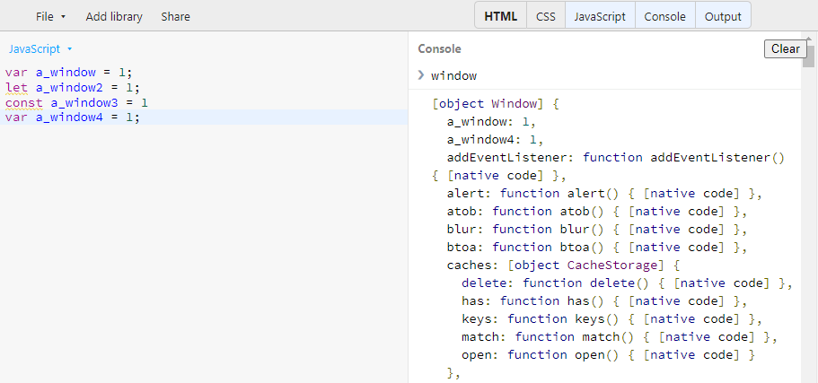
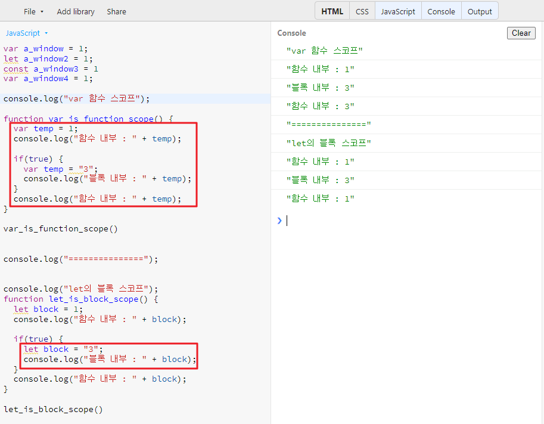

# 자바스크립트 변수

## 변수
- 변수는 데이터를 저장할 때 쓰이는 '이름이 붙은 저장소'이다.

## let, const
- 블록 스코프
- 함수, if 문, for 문, while 문, try/catch 문 등

## var
- 함수 스코프
- 한번 선언된 변수를 다시 선언할 수 있다.
- var 는 선언하기 전에 사용할 수 있다.
- var는 브라우저의 전역 객체인 window 객체에에 속하게 된다
  

### var 와 let
- 거의 동일하게 동작하지만 var 는 블록 스코프가 없다.
- var 로 선언된 변수의 스코프는 함수 스코프이거나 전역 스코프이다.
- 블록 기준으로 스코프가 생기지 않기 때문에 블록 밖에서 접근이 가능하다.
  

## 호이스팅
- var 의 선언은 호이스팅 되지만, 할당은 호이스팅 되지 않는다.
- 스코프 내부 어디서든 변수 선언은 최상위에 선언된 것처럼 행동한다.

### Temporal Dead Zone
- let 과 const 는 이 TDZ 의 영향을 받는다.
- 이는 코드를 예측 가능하게 하고, 잠재적인 버그를 줄일 수 있다.
  
## 일반적인 변수 생성 과정
1. 선언 단계
2. 초기화 단계
3. 할당 단계

## var 변수의 생성 과정
1. 선언 및 초기화 단계
2. 할당 단계

### 초기화 단계
- undefined 를 할당해주는 단계
  
## let 변수의 생성 과정
1. 선언 단계
   - 호이스팅 되면서 선언 단계가 이루어진다.
2. 초기화 단계
   - 실제 코드에 도달 했을 때 되기 때문에 래퍼런스 에러를 발생 시킬 수 있다.
3. 할당 단계

## const 변수의 생성 과정
1. 선언 + 초기화 + 할당
   - 선언과 할당이 동시에 되어야 한다

### 출처
- [MDN](https://developer.mozilla.org/ko/)
- [코딩앙마 유튜브](https://youtube.com/codingangma/)
- [모던 자바스크립트](https://ko.javascript.info)
