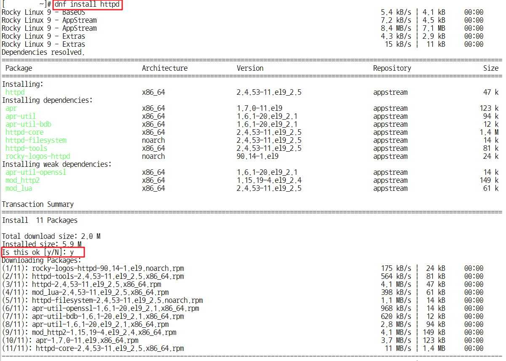
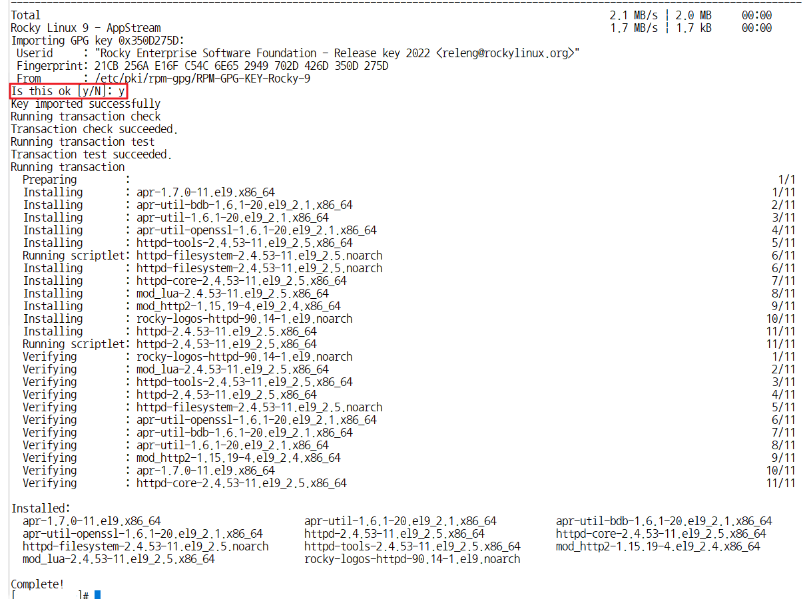
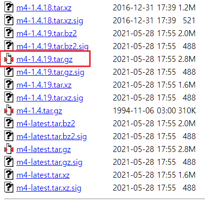
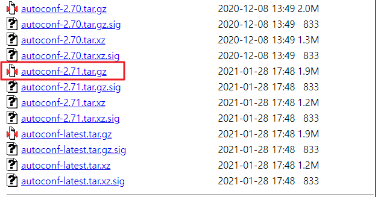
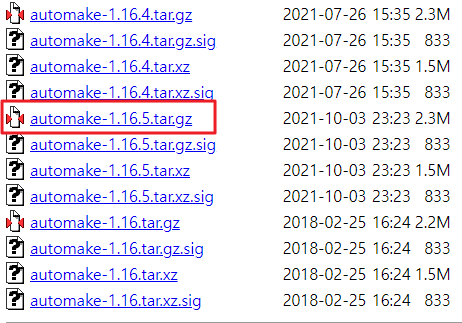
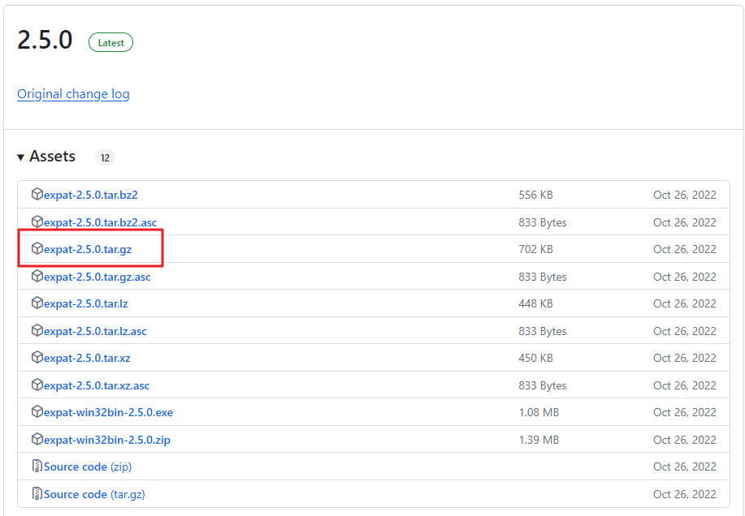
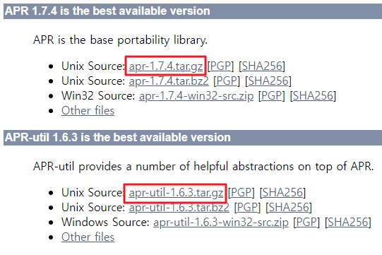
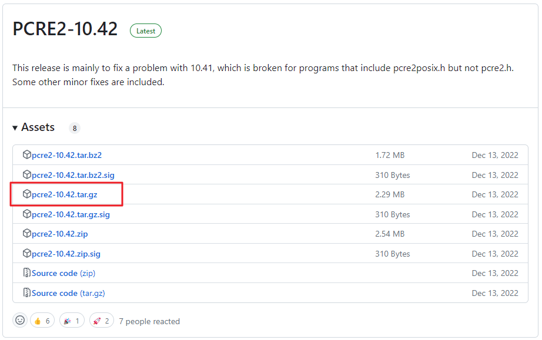
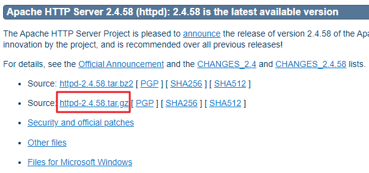

# 1. 아파치(Apache) 자동 설치

    1. dnf install httpd 명령어를 이용하여 쉽게 설치 가능
    2. 선택지가 나오면 y 입력

  
  

# 2. 아파치(Apache) 수동 설치

    1. ServerRoot : /usr/local/apache
    2. 각 파일들 링크 클릭 후 다운로드
    3. winscp 또는 filezilla와 같은 ftp 서버를 이용하여 파일을 전달
      1) mkdir -p /tmp/lib
      2) cd /tmp/lib
      3) tar zxfv 파일이름
    4. 압축 해제 후 설치 순서에 맞게 설치하기

### 1. [m4](https://ftp.gnu.org/gnu/m4/)
    1. cd /tmp/lib/m4-1.4.19
    2. ./configure --prefix=/usr
    3. make && make install

### 2. [autoconf](https://ftp.gnu.org/gnu/autoconf/)
    1. cd /tmp/lib/autoconf-2.71
    2. ./configure --prefix=/usr
    3. make && make install

### 3. [automake](https://ftp.gnu.org/gnu/automake/)
    1. cd /tmp/lib/automake-1.16.5
    2. ./configure --prefix=/usr
    3. make && make install

### 4. [expat](https://github.com/libexpat/libexpat/releases)
    1. cd /tmp/lib/expat-2.5.0
    2. ./configure --prefix=/usr
    3. make && make install

### 5. [apr](https://apr.apache.org/download.cgi)
    1. cd /tmp/lib/apr-1.7.4
    2. ./configure --prefix=/usr/local/src/apr-1.7.4
    3. cp -arp libtool libtoolT
    4. make && make install
    5. libtool --finish /usr/lib

### 6. [apr-util](https://apr.apache.org/download.cgi)
    1. cd /tmp/lib/apr-util-1.6.3
    2. ./configure --prefix=/usr/local/src/apr-util-1.6.3 --with-apr=/usr/local/src/apr-1.7.4
    3. make && make install

### 7. [pcre](https://github.com/PCRE2Project/pcre2/releases)
    1. cd /tmp/lib/pcre2-10.42
    2. export PKG_CONFIG_PATH=/usr/local/src/apr-1.7.4/lib/pkgconfig:/usr/local/src/apr-util-1.6.3/lib/pkgconfig
       ./configure --prefix=/usr/local/src/pcre2-10.42
    3. make && make install

### 8. [httpd](https://httpd.apache.org/download.cgi)
    1. cd /tmp/lib/httpd-2.4.58
    2. ./configure --prefix=/usr/local/apache --enable-modules=most --enable-mods-shared=all --enable-so --with-apr=/usr/local/src/apr-1.7.4 --with-apr-util=/usr/local/src/apr-util-1.6.3 --with-pcre=/usr/local/src/pcre2-10.42/bin/pcre2-config
    3. make && make install

### 출처
- [나무위키](https://namu.wiki/)
- [아파치 공식 사이트](https://httpd.apache.org/)
