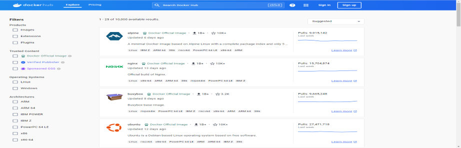

# 도커란?

- 도커(Docker)는 컨테이너 기반의 가상화 플랫폼으로, 소프트웨어를 패키지화하고 이를 실행하는 데 사용된다. 
- 도커를 사용하면 응용 프로그램과 그에 필요한 모든 종속성을 독립적이고 이식성 있는 컨테이너로 감싸고, 이를 호스트 운영체제와 격리된 환경에서 실행할 수 있다.

## 도커를 사용하는 용도

### 빠르고 일관된 애플리케이션 제공

- Docker는 개발자가 애플리케이션과 서비스를 제공하는 로컬 컨테이너를 사용하여 표준화된 환경에서 작업할 수 있도록 하여 개발 수명 주기를 간소화한다. 
- 컨테이너는 CI/CD(지속적인 통합 및 지속적 전달) 워크플로에 적합하다.

### 반응형 배포 및 확장 가능
- Docker의 컨테이너 기반 플랫폼은 이식성이 뛰어난 워크로드를 허용한다. 
- Docker 컨테이너는 개발자의 로컬 노트북, 데이터 센터의 물리적 또는 가상 머신, 클라우드 공급자 또는 혼합된 환경에서 실행될 수 있다.


## 도커 엔진

- 도커 엔진은 컨테이너를 생성하고 관리하는 역할을 수행하는 소프트웨어이다.

## 도커 용어 정리

### 이미지
- 도커 컨테이너를 생성하는 템플릿으로, 파일 시스템 및 실행 환경 등 모든 것이 포함되어 있다. 
- 이미지는 응용 프로그램을 실행하기 위해 필요한 모든 정보를 가지고 있다.

### 컨테이너
- 이미지의 인스턴스로, 격리된 프로세스를 실행하는 가벼운 환경이다. 
- 여러 컨테이너는 동일한 호스트에서 독립적으로 실행될 수 있다.

## 도커 허브

- 도커 이미지를 저장하고 관리하는 공개 및 비공개 저장소이다. 
- 여러 사용자가 이미지를 공유하고 가져다 사용할 수 있다.
  - 익명 사용자의 경우 6시간 당 100개
  - 인증된 사용자의 경우 6시간당 200개
  - 유료 사용자는 하루 5000개 다운이 가능하다.

### 도커 클라이언트 및 서버
- 도커는 클라이언트-서버 아키텍처를 사용하며, 도커 클라이언트를 통해 도커 서버와 상호 작용한다. 
- 도커 서버는 컨테이너 관리, 이미지 빌드, 네트워킹 등을 담당한다.

# 윈도우 설치법
## WSL 2 사용
- PowerShell 또는 Window 명령 프롬프트(cmd)에서 간단한 명령어 입력을 통해 WSL2를 설치할 수 있다.
- 설치를 위해 관리자 권한이 필요하기 때문에 반드시 관리자 권한으로 PowerShell 혹은 Window 명령 프롬프트를 실행해야 한다.

  ```shell
  # 설치하기
  wsl --install
  
  # 재시작 이후
  wsl --set-default-version 2
  
  # Ubuntu를 통해 사용 가능
  # Add Docker's official GPG key:
  sudo apt-get update
  sudo apt-get install ca-certificates curl gnupg
  sudo install -m 0755 -d /etc/apt/keyrings
  curl -fsSL https://download.docker.com/linux/ubuntu/gpg | sudo gpg --dearmor -o /etc/apt/keyrings/docker.gpg
  sudo chmod a+r /etc/apt/keyrings/docker.gpg
  
  # Add the repository to Apt sources:
  echo \
    "deb [arch=$(dpkg --print-architecture) signed-by=/etc/apt/keyrings/docker.gpg] https://download.docker.com/linux/ubuntu \
    $(. /etc/os-release && echo "$VERSION_CODENAME") stable" | \
    sudo tee /etc/apt/sources.list.d/docker.list > /dev/null
  sudo apt-get update
  
  # 도커 설치
  sudo apt-get install docker-ce docker-ce-cli containerd.io docker-buildx-plugin docker-compose-plugin
  
  # 도커 설치 확인
  sudo docker run hello-worldps 
  ```

### 출처
- [나무위키](https://namu.wiki/)
- [도커 DOC](https://docs.docker.com/)
