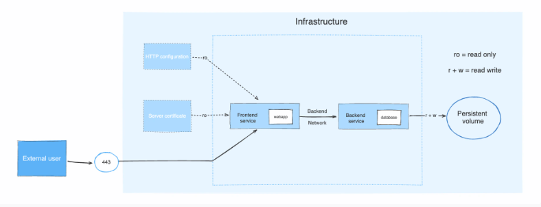

# Docker Compose
- Docker Compose 란 단일 서버에서 여러 개의 컨테이너를 하나의 서비스로 정의해
- 컨테이너의 묶음으로 관리할 수 있는 작업환경을 제공하는 관리도구이다.

## Docker Compose 사용 이유
- 컨테이너를 하나씩 생성하는 번거로움을 줄일 수 있다.
- 다양한 환경에서 애플리케이션을 실행 할 때 일관된 환경을 유지할 수 있다.
- 새로운 서비스나 컴포넌트를 간단히 추가하거나 업데이트 할 수 있다.
- 여러 환경에서 자동화 된 배포를 구현할 수 있다.

## Docker Compose 설치 방법 (Docker 가 설치되어있는 상황)
```shell
# Ubuntu 및 Debian 의 경우
sudo apt-get update
sudo apt-get install docker-compose-plugin

# RPM 기반인 경우
sudo yum update
sudo yum install docker-compose-plugin

# 공통 사항 - 버전을 확인하여 올바르게 설치 되었는지 확인한다.
docker compose version

```

## Docker Docs 에 나오는 예시


```yaml
# 서비스에 대한 정의
services:
  # 서비스 1의 이름은 frontend
  frontend:
    # 이미지는 example/webapp 를 가져온다
    image: example/webapp
    # 포트는 backend의 443 포트를 로컬 호스트의 8043 포트랑 매칭을 하겠다.
    ports:
      - "443:8043"
    # 서비스가 속한 네트워크에 대한 정의
    networks:
      - front-tier
      - back-tier
    # 서비스에 사용되는 설정
    configs:
      - httpd-config
    # 서비스에 사용되는 보안 정보
    secrets:
      - server-certificate

  # 서비스 2의 이름은 backend
  backend:
    # 이미지는 example/database 를 가져온다
    image: example/database
    # 컨테이너와 호스트 간 데이터를 공유하는 볼륨 지정
    volumes:
      - db-data:/etc/data
    networks:
      - back-tier

volumes:
  db-data:
    # 드라이버는 flocker를 사용한다.
    driver: flocker
    # 사이즈는 10Gib이다.
    driver_opts:
      size: "10GiB"

# frontend 에서 사용되는 외부 설정
configs:
  httpd-config:
    external: true

# frontend 에서 사용되는 외부 비밀
secrets:
  server-certificate:
    external: true

# 네트워크들에 대한 정의
networks:
  # The presence of these objects is sufficient to define them
  front-tier: {}
  back-tier: {}
```

## YAML이란?
- YAML Ain’t Markup Language의 약자
- JSON, XML과 같이 시스템 간 데이터 교환을 위해 만들어졌으며 Key-Value 구조를 기본으로 한다.
- 대소문자를 구분하며 구조를 구분할 때는 들여쓰기를 기준으로 한다.
- 값으로 문자열, 숫자, boolean을 모두 가질 수 있다
- 주석 표기는 # 으로 표시한다.
- YAML 파일에서 들여쓰기 할 때 탭은 도커 컴포즈가 인식하지 못하기 때문에 2개의 공백을 이용해 구분한다

## Dependency Track 으로 보는 Docker Compose 추가 예시
```yaml
version: '3.7'

# 볼륨에 대한 정의
volumes:
  dependency-track:

# 서비스에 대한 정의
# dependecny track은 먼저 api server가 있는 것을 알 수 잇다.
services:
  dtrack-apiserver:
    # 이미지는 dependencytrack/apiserver 를 기반으로 한다. 
    image: dependencytrack/apiserver
    
    # 포트는 apiserver의 8080 포트를 로컬 호스트의 8081 포트랑 매칭을 하겠다.
    ports:
      - '8081:8080'
    # 볼륨에 대한 정의
    volumes:
      - 'dependency-track:/data'
    # # 부팅시 자동으로 재시작
    restart: unless-stopped

  dtrack-frontend:
    # 이미지는 dependencytrack/frontend 을 기반으로 한다. 
    image: dependencytrack/frontend
    # dtrack-apiserver 가 실행이 완료 된 이후에 실행이 된다.
    depends_on:
      - dtrack-apiserver
    environment:
      - API_BASE_URL=http://localhost:8081
    # 포트는 frontend의 8080 포트를 로컬 호스트의 8080 포트랑 매칭을 하겠다.
    ports:
      - "8080:8080"
    # 부팅시 자동으로 재시작
    restart: unless-stopped
```

---
##  # 출처
- [나무위키](https://namu.wiki/)
- [도커 DOC](https://docs.docker.com/engine/reference/run/)
- [Dependency Track](https://docs.dependencytrack.org/)
