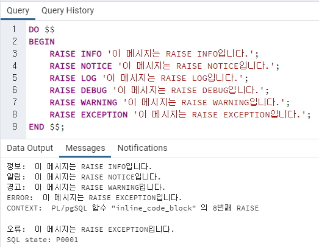

# PostgreSQL RAISE 란?
- PL/pgSQL에서 메시지를 출력하거나 예외를 발생시키는 데 사용된다.
- 디버깅, 로깅, 오류 처리 등을 효과적으로 할 수 있다.

## RAISE 문법
```postgresql
RAISE level 'message' [, parameter [, ...]] [USING option = value [, ...]];
```
- level: 메시지의 중요도를 설정한다. (DEBUG, LOG, NOTICE, WARNING, EXCEPTION 등)
- message: 출력할 메시지를 지정한다.
- parameter: 메시지에 삽입할 값을 지정할 수 있다.
- USING option = value: 추가적인 정보를 전달할 때 사용된다.

## RAISE의 주요 레벨

| 레벨        | 설명                          |
|:----------|:----------------------------|
| DEBUG     | 디버깅 메시지를 출력                 |
| LOG       | 서버 로그에 기록됨 (사용자에게는 출력되지 않음) |
| NOTICE    | 일반적인 알림 메시지를 출력             |
| WARNING   | 경고 메시지를 출력 (실행은 계속됨)        |
| EXCEPTION | 예외를 발생시키고 실행을 중단            |
| INFO      | 메시지를 출력                     |

## 사용 방법
### 메시지 출력, 일반적인 알림 (NOTICE)
```postgresql
DO $$ 
BEGIN
    RAISE NOTICE '현재 날짜: %', CURRENT_DATE;
END $$;
```
```yaml
NOTICE:  현재 날짜: 2025-02-02
```
- client_min_messages 기본값, 기본적으로 클라이언트에 출력됨
- 로그에도 기록될 수 있음

### 정보메시지 (INFO)
```postgresql
DO $$
  BEGIN
    RAISE INFO '정보 메시지 출력';
  END $$;
```
- client_min_messages 상관 없이 항상 출력
- 디버깅이나 세부 정보 출력 용도

### 경고메시지 (WARNING)
```postgresql
DO $$
  BEGIN
    RAISE WARNING '경고 메시지 출력';
  END $$;
```
- log_min_messages 기본 값

### 예외 발생 (EXCEPTION)
```postgresql
DO $$
  BEGIN
    RAISE EXCEPTION '잘못된 값입니다!';
  END $$;
```
```yaml
ERROR:  잘못된 값입니다!
```
### 변수 삽입 (USING)
```postgresql
DO $$
  DECLARE
    user_id INT := 123;
  BEGIN
    RAISE NOTICE '사용자 ID: %', user_id USING ERRCODE = '22023';
  END $$;
```

### Pgadmin 실행 예시

- INFO, NOTICE, WARNING 출력 후 EXCEPTION 에서 에러가 발생된 모습

## RAISE를 활용한 예외 처리
### 예외를 잡아서 처리
```postgresql
DO $$ 
BEGIN
    BEGIN
        RAISE EXCEPTION '오류 발생!';
    EXCEPTION
        WHEN OTHERS THEN
            RAISE WARNING '예외 발생: %', SQLERRM;
    END;
END $$;
```
- 내부 BEGIN ... EXCEPTION 블록에서 예외가 발생해도, 외부 블록에서 WARNING 메시지로 대체하여 실행을 계속할 수 있다.


## 활용 예시: 로그 기록을 위한 RAISE
```postgresql
CREATE OR REPLACE FUNCTION log_message() RETURNS VOID AS $$
BEGIN
RAISE LOG '로그 기록: %', now();
END;
$$ LANGUAGE plpgsql;
```
- LOG 레벨을 사용하면 PostgreSQL 서버 로그에만 기록되고 기본적으로 클라이언트에게는 표시되지 않는다.

## 시스템 설정
### client_min_messages
  - DEBUG5, DEBUG4, DEBUG3, DEBUG2, DEBUG1, LOG, NOTICE, WARNING, and ERROR
  - 기본적으로 우측으로 갈수록 로그 메시지가 줄어듦
  - 기본 값은 NOTICE이다.
  - INFO 레벨 메시지는 항상 CLIENT 에 출력된다.
### log_min_messages
  -  DEBUG5, DEBUG4, DEBUG3, DEBUG2, DEBUG1, INFO, NOTICE, WARNING, ERROR, LOG, FATAL PANIC
  - 기본적으로 우측으로 갈수록 로그 메시지가 줄어듦
  - 기본 값은 WARNING이다.
  - SUPERUSER 권한을 가진 사용자와 SET privilege(특권)을 가진 USER만 변경 가능하다.
### 확인 방법
```postgresql
SHOW client_min_messages;
SHOW log_min_messages;
```
### 변경 방법
```postgresql
SET client_min_messages = 'WARNING';
SET log_min_messages = 'NOTICE';
```


### 출처
- [나무위키](https://namu.wiki/)
- [PostgreSQL 문서](https://www.postgresql.org/docs/current/information-schema.html)
