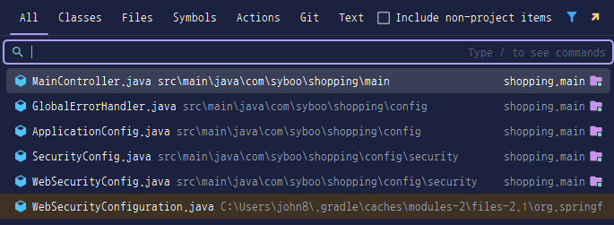
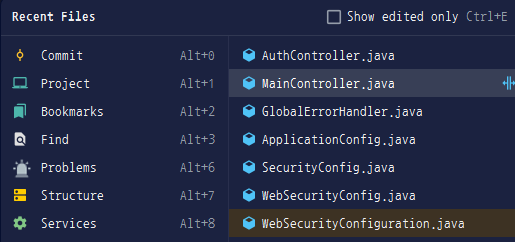
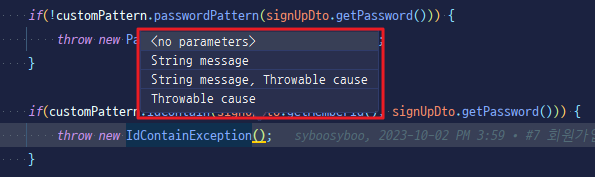
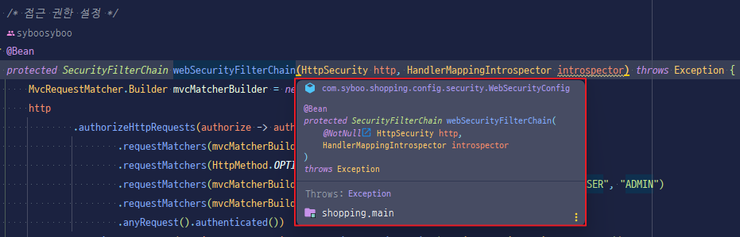
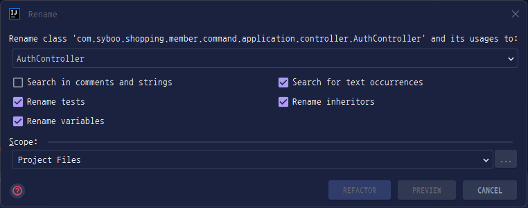
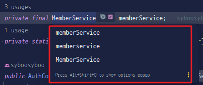
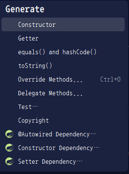
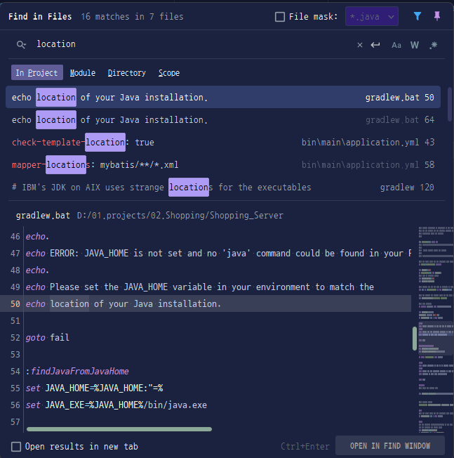
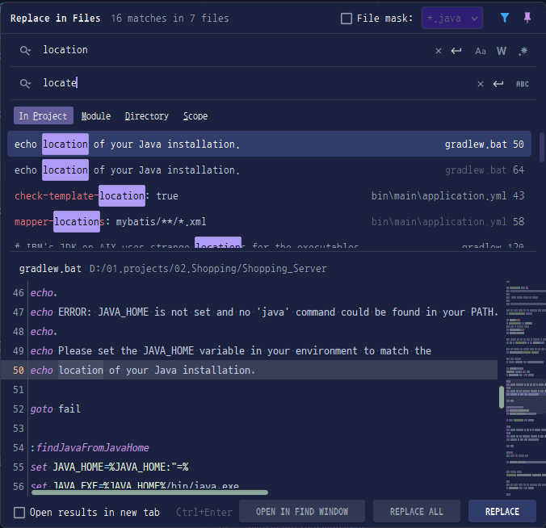

## 네비게이션 및 검색
### Search Everywhere
  - 두 번의 Shift 키를 눌러 프로젝트 내 모든 파일, 클래스, 설정 등을 빠르게 검색할 수 있다.
  

### Find Action
  - Ctrl + Shift + A
  - 다양한 액션(명령어)을 검색 및 실행할 수 있다.
    

### Navigate to Class
   - Ctrl + N
   - 클래스 이름으로 빠르게 이동할 수 있다.
     

### Navigate to File
   - Ctrl + Shift + N
   - 파일 이름으로 프로젝트 내 파일을 검색한다.
     

### Navigate to Symbol
   - Ctrl + Alt + Shift + N
   - 메서드나 변수와 같은 심볼을 검색할 수 있다.
     

### Recent Files / Recent Edited Files
   - Ctrl + E / Ctrl + Shift + E
   - 최근 열었던 파일이나 수정한 파일을 빠르게 전환할 수 있다.
     

## 코드 편집 및 작성
### 코드 완성
  - 일반 완성: Ctrl + Space
  - 스마트 완성: Ctrl + Shift + Space
    - 현재 문맥에 맞는 보다 정교한 완성 제안을 받을 수 있다.

### 파라미터 정보 표시
  - Ctrl + P
  - 메서드 호출 시 인자 정보를 보여준다.
    

### 문서 보기
  - Ctrl + Q
  - 선택한 코드에 대한 빠른 문서를 확인할 수 있다.
    
      
### 자동 임포트
  - Alt + Enter
  - 필요한 라이브러리나 클래스를 자동으로 임포트한다.

### 코드 서식 정리
  - Ctrl + Alt + L
  - 코드 스타일에 맞게 자동으로 들여쓰기 및 서식을 맞춘다.

### 임포트 최적화
  - Ctrl + Alt + O
  - 사용하지 않는 임포트를 제거합니다.

### 주석 처리 / 해제
  - Ctrl + /
  - 한 줄 주석 토글
  - Ctrl + Shift + /
  - 여러 줄 주석 처리 (환경에 따라 다를 수 있음)

## 리팩토링
### 이름 변경 (Rename)
  - Shift + F6
  - 선택한 변수, 메서드, 클래스 등의 이름을 일괄 변경한다.
  

### 메서드 시그니처 변경
  - Ctrl + F6
  - 메서드의 파라미터 등을 변경할 수 있습니다.
    

### Extract (변수/메서드 등 추출)
  - 변수 추출: Ctrl + Alt + V
  - 메서드 추출: Ctrl + Alt + M
    - 중복되는 코드나 복잡한 표현을 별도의 변수 또는 메서드로 분리한다.

## 코드 생성 및 편집 보조
### Generate Code (코드 생성)
  - Alt + Insert
  - getter/setter, 생성자, toString 등 반복적인 코드를 자동으로 생성한다.
    

### 라인 복사 / 삭제 / 이동
  - 라인 복사: Ctrl + D
  - 라인 삭제: Ctrl + Y
  - 라인 이동: Alt + Shift + ↑/↓
    -  코드를 빠르게 조작할 때 유용하다.

## 검색 및 치환
### 현재 파일 내 검색
  - Ctrl + F
    

### 현재 파일 내 치환
  - Ctrl + R
    

### 프로젝트 전체 검색
  - Ctrl + Shift + F
    - 특정 문자열이나 패턴을 프로젝트 전체에서 검색한다.
      

### 프로젝트 전체 치환
  - Ctrl + Shift + R
    - 전체 검색 결과를 바탕으로 한 번에 치환할 수 있다.
      

### 글 작성 이유
- Eclipse와 IntelliJ를 함께 사용하다 보니 단축키가 자꾸 헷갈려서 정리했습니다.

### 출처
- [Intellij 공식문서](https://www.jetbrains.com/help/idea/mastering-keyboard-shortcuts.html)
- [나무위키](https://namu.wiki/)
