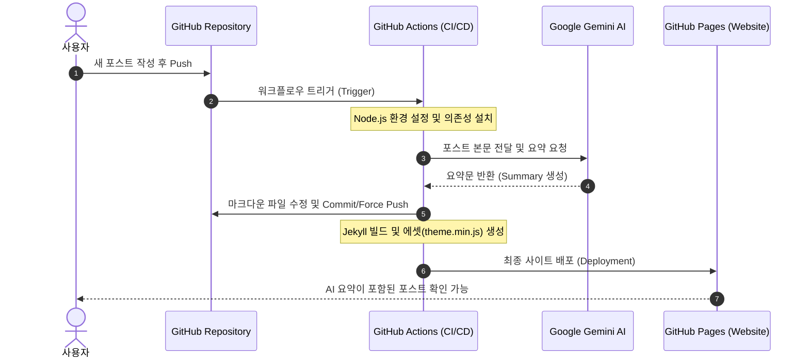

## 🤖 Introduction
포스트가 길어질수록 독자들은 핵심 내용을 빠르게 파악하고 싶어 합니다. 
이를 위해 **Google Gemini AI**를 활용하여 새 글을 올릴 때마다 AI가 자동으로 요약문을 작성하고, 
상단에 토글 UI로 보여주는 시스템을 구축했습니다.

---

## ⚙️ Preparation: API 및 권한 설정

코드 작성 전, Gemini API를 호출하고 GitHub Actions가 이를 사용할 수 있도록 설정해야 합니다.

### 1. Gemini API 키 발급
1. [Google AI Studio](https://aistudio.google.com/)에 접속합니다.
2. **'Get API key'** 버튼을 클릭하여 새로운 API 키를 생성합니다.
3. 발급받은 키를 복사해둡니다.

### 2. GitHub Secrets 등록
발급받은 API 키는 보안을 위해 코드에 직접 적지 않고 GitHub Secrets에 저장합니다.
1. 내 블로그 리포지토리의 **Settings > Secrets and variables > Actions**로 이동합니다.
2. **'New repository secret'**을 클릭합니다.
3. **Name**에 `GEMINI_API_KEY`를 입력합니다.
4. **Value**에 아까 복사한 API 키를 붙여넣고 저장합니다.

### 3. Workflow 권한 허용
1. **Settings > Actions > General**로 이동합니다.
2. 하단의 **Workflow permissions**에서 **'Read and write permissions'**를 선택하고 저장합니다.
  - 이 설정을 해야 봇이 코드를 수정하고 다시 푸시할 수 있습니다.

---

## 🏗️ System Architecture



1. **Trigger**: 사용자가 새 마크다운(`*.md`) 포스트를 작성하여 `main` 브랜치에 병합 또는 `push`합니다.
2. **AI Processing**: GitHub Actions가 구동되며 `generate_summary.mjs` 스크립트를 실행합니다. 
이 스크립트는 Gemini API를 호출하여 본문을 요약합니다.
3. **Data Integration**: 생성된 요약문을 해당 마크다운 파일의 Front-matter(`summary: '...'`)에 자동으로 삽입하고 
리포지토리에 다시 `commit & push`합니다.
4. **Site Deployment**: 요약 정보가 업데이트된 최신 소스를 바탕으로 Chirpy 테마를 빌드하고
 GitHub Pages로 최종 배포합니다.

---


## 🛠️ Implementation

### 1. AI Summary 스크립트 (`generate_summary.mjs`)

```javascript
import fs from 'fs';
import path from 'path';
import { fileURLToPath } from 'url';
import { GoogleGenerativeAI } from '@google/generative-ai';

// --- 1. 경로 및 환경 설정 ---
const __filename = fileURLToPath(import.meta.url);
const __dirname = path.dirname(__filename);
const POSTS_DIR = path.join(__dirname, './_posts');

// --- 2. Gemini 설정 ---
const API_KEY = process.env.GEMINI_API_KEY;
const genAI = new GoogleGenerativeAI(API_KEY);
const model = genAI.getGenerativeModel({ model: 'gemini-2.5-flash' });

// --- 3. 유틸리티 함수 (대기 시간) ---
const sleep = (ms) => new Promise(resolve => setTimeout(resolve, ms));

// --- 4. 텍스트 정제 객체 (쌍따옴표 금지) ---
const TextCleaner = {
  clean: (text) => {
    if (!text) return '';
    return text
      .trim()
      .replace(/'/g, '\'\'')    // YAML 이스케이프
      .replace(/"/g, '')        // 쌍따옴표 제거
      .replace(/\n/g, ' ')
      .replace(/\s+/g, ' ');
  }
};

// --- 5. 요약 생성 함수 ---
async function generateSummary(content) {
  const body = content.replace(/^---[\s\S]*?---/, '').substring(0, 5000);
  const prompt = '다음 블로그 글을 한국어로 2~3문장 요약해줘. 간결하게 \'~함\'체로 작성해줘:\n\n' + body;

  try {
    const result = await model.generateContent(prompt);
    const response = await result.response;
    return TextCleaner.clean(response.text());
  } catch (error) {
    console.error('❌ Gemini 호출 실패: ' + error.message);
    return null;
  }
}

// --- 6. 메인 실행 로직 ---
async function processPosts() {
  if (!fs.existsSync(POSTS_DIR)) {
    console.error('❌ 에러: _posts 폴더를 찾을 수 없습니다.');
    return;
  }

  const files = fs.readdirSync(POSTS_DIR).filter(f => f.endsWith('.md'));
  console.log('🚀 총 ' + files.length + '개의 포스트를 검사합니다.');

  for (const file of files) {
    const filePath = path.join(POSTS_DIR, file);
    let content = fs.readFileSync(filePath, 'utf8');

    // 이미 summary가 설정되어 있는지 확인
    if (content.match(/\nsummary:\s*'/)) {
      console.log('⏩ 패스: ' + file);
      continue;
    }

    console.log('🤖 요약 생성 중: ' + file + '...');
    const summary = await generateSummary(content);

    if (summary) {
      const newContent = content.replace(
        /^(---\s*[\s\S]*?)(\n---)/,
        '$1\nsummary: \'' + summary + '\'$2'
      );

      fs.writeFileSync(filePath, newContent, 'utf8');
      console.log('✅ 완료: ' + file);

      // ★ 핵심: API 무료 티어 제한(RPM)을 피하기 위해 15초 대기
      console.log('💤 15초간 대기 후 다음 작업을 진행합니다...');
      await sleep(15000);
    }
  }
  console.log('✨ 모든 작업이 끝났습니다!');
}

processPosts();
```

### 2-1. Frontend UI Components (_includes/ai-summary.html)

```html

<div id="ai-summary-wrapper" class="rounded border mb-4">
  <div class="d-flex align-items-center p-3 bg-light-alt" id="ai-summary-header" style="cursor: pointer;">
    <i class="fas fa-robot text-info me-2"></i>
    <span class="fw-bold">AI 요약</span>
    <i id="summary-chevron" class="fas fa-chevron-down ms-auto transition-icon"></i>
  </div>

  <div id="ai-summary-content" class="p-3 border-top overflow-hidden">
    <div class="text-muted">
      {{ page.summary | markdownify }}
    </div>
  </div>
</div>

<style>
  .bg-light-alt { background-color: var(--main-wrapper-bg); }
  .transition-icon { transition: transform 0.3s ease; }
  .rotate-180 { transform: rotate(180deg); }
  #ai-summary-content {
    transition: max-height 0.3s ease-out, opacity 0.3s ease;
    max-height: 500px; /* 충분한 높이 */
    opacity: 1;
  }
  #ai-summary-content.hidden {
    max-height: 0;
    opacity: 0;
    padding: 0 !important;
    border-top: none !important;
  }
</style>

```

### 2-2. Frontend UI Components(_layouts/post.html))


```html
  

  <div class="content">
    {{ content }}
  </div>
```


### 3-1. JavaScript Logic & Module Setup(_javascript/modules/components/ai-summary-toggle.js)
```javascript
/**
 * AI Summary Toggle Logic
 */
export function initAiSummary() {
  const header = document.getElementById('ai-summary-header');
  const content = document.getElementById('ai-summary-content');
  const chevron = document.getElementById('summary-chevron');

  if (header && content) {
    header.addEventListener('click', () => {
      // 클래스 토글 (CSS로 애니메이션 처리)
      content.classList.toggle('hidden');

      // 화살표 회전
      if (chevron) {
        chevron.classList.toggle('rotate-180');
      }
    });
  }
}

```
### 3-2. JavaScript Logic & Module Setup(_javascript/modules/components.js)
```javascript
export { initAiSummary } from './components/ai-summary-toggle'; 추가
```

### 3-3. JavaScript Logic & Module Setup(_javascript/post.js)

```javascript
import { basic, initTopbar, initSidebar } from './modules/layouts';
import {
  loadImg,
  imgPopup,
  initLocaleDatetime,
  initClipboard,
  initToc,
  loadMermaid,
  initAiSummary // 추가
} from './modules/components';

loadImg();
initToc();
imgPopup();
initSidebar();
initLocaleDatetime();
initClipboard();
initTopbar();
loadMermaid();
initAiSummary(); // 실행
basic();
```

### 4. GitHub Actions 설정 (.github/workflows/pages-deploy.yml)
```yaml
name: "Build and Deploy"
on:
  push:
    branches:
      - main
      - master
    paths-ignore:
      - .gitignore
      - README.md
      - LICENSE

  # Allows you to run this workflow manually from the Actions tab
  workflow_dispatch:

permissions:
  contents: write
  pages: write
  id-token: write

# Allow one concurrent deployment
concurrency:
  group: "pages"
  cancel-in-progress: true

jobs:
  build:
    runs-on: ubuntu-latest

    steps:
      - name: Checkout
        uses: actions/checkout@v6
        with:
          fetch-depth: 0
          submodules: true
          # If using the 'assets' git submodule from Chirpy Starter, uncomment above
          # (See: https://github.com/cotes2020/chirpy-starter/tree/main/assets)

      # --- 여기서부터 AI 요약 단계 시작 ---
      - name: Setup Node.js for Summary
        uses: actions/setup-node@v6
        with:
          node-version: '20'
          cache: 'npm' # 캐시를 사용하면 빌드 속도가 빨라집니다.

      # 2. 필수 패키지 설치 (이 단계가 없으면 SCSS 빌드 에러 발생)
      - name: Install Node dependencies
        run: npm install

      - name: Install Gemini SDK
        run: npm install @google/generative-ai

      - name: Generate AI Summary
        env:
          GEMINI_API_KEY: ${{ secrets.GEMINI_API_KEY }}
        run: node generate_summary.mjs

      - name: Commit AI Summaries
        run: |
          git config --global user.name 'github-actions[bot]'
          git config --global user.email 'github-actions[bot]@users.noreply.github.com'
          git add _posts/*.md package-lock.json
          # 변경사항이 있을 때만 커밋
          git diff --quiet && git diff --staged --quiet || (git commit -m '🤖 AI 요약 자동 생성' && git push origin main --force)
      # --- AI 요약 단계 끝 ---
      # Chirpy 테마의 JS/CSS를 빌드
      - name: Build Theme Assets
        run: npm run build

      - name: Setup Pages
        id: pages
        uses: actions/configure-pages@v5

      - name: Setup Ruby
        uses: ruby/setup-ruby@v1
        with:
          ruby-version: 3.3
          bundler-cache: true

      - name: Build site
        run: bundle exec jekyll b -d "_site${{ steps.pages.outputs.base_path }}"
        env:
          JEKYLL_ENV: "production"

      - name: Test site
        run: |
          bundle exec htmlproofer _site \
            \-\-disable-external \
            \-\-ignore-urls "/^http:\/\/127.0.0.1/,/^http:\/\/0.0.0.0/,/^http:\/\/localhost/"

      - name: Upload site artifact
        uses: actions/upload-pages-artifact@v4
        with:
          path: "_site${{ steps.pages.outputs.base_path }}"

  deploy:
    environment:
      name: github-pages
      url: ${{ steps.deployment.outputs.page_url }}
    runs-on: ubuntu-latest
    needs: build
    steps:
      - name: Deploy to GitHub Pages
        id: deployment
        uses: actions/deploy-pages@v4

```

## ⚠️ Troubleshooting

### 1. 403 Forbidden (Permission Denied)
봇이 `main` 브랜치에 직접 Push할 권한이 없어 발생한 에러입니다.

* **원인**: GitHub Actions의 기본 권한이 `read`로 설정되어 있어 발생합니다.
* **해결**:
  * `.yml` 파일에 `permissions: contents: write`를 추가하여 쓰기 권한을 명시합니다.
  * Repository **Settings > Branches > Branch Protection Rule**에서 **'Allow force pushes'**를
  활성화하여 봇의 강제 푸시를 허용합니다.

### 2. theme.min.js Missing Error
봇이 파일을 수정한 뒤, 사이트를 다시 빌드할 때 필수 에셋(JS/CSS)이 누락되어 배포된 페이지가 
깨지는 현상입니다.

* **원인**: Chirpy 테마는 `npm run build`를 통해 `assets/js/dist` 폴더에 압축된 스크립트를 생성하는데, 
이 과정이 누락되었기 때문입니다.
* **해결**: Jekyll 빌드 명령어(`bundle exec jekyll b`)를 실행하기 전, 반드시 **`npm run build`** 
단계를 추가하여 정적 자산을 먼저 생성해야 합니다.

### 3. AI 요약 요청이 실패할 경우 (모델 확인)
Gemini 모델명은 수시로 업데이트되거나 지원 종료될 수 있습니다.
* **체크포인트**: `generate_summary.mjs` 코드 내의 `model: 'gemini-2.5-flash'`(또는 사용 중인 모델명)이 
현재 Google AI Studio에서 지원하는 최신 모델명인지 확인하세요. 존재하지 않는 모델명을 입력하면 
API 호출 자체가 거부됩니다.
* [Gemini API](https://ai.google.dev/gemini-api/docs/models?hl=ko) 에서 모델 확인

### 4. 작업 중 갑자기 멈추는 경우 (생성 제한)
포스트 개수가 너무 많을 때 요약 생성 도중 중단될 수 있습니다.
* **원인**: Google Gemini API 무료 티어의 **RPM(분당 요청 수 5개)** 또는 **RPD(일당 요청 수 20개)** 제한에 
걸린 것입니다.
* **해결**:
  * 현재 코드에 적용된 `sleep(15000)` (15초 대기) 시간을 더 늘리거나,
  * 하루에 처리할 포스트 양(20개 미만)을 조절해야 합니다.
  * 이미 요약된 포스트는 건너뛰도록 작성된 `if (content.match(/\nsummary:\s*'/))` 로직이 정상 
  작동하는지 확인하세요.


## 6. ✨ Conclusion

### 🚀 자동화가 가져온 변화
단순히 "요약문을 보여준다"는 기능을 넘어, **GitHub Actions**와 **Gemini API**를 연계한 
자동화 파이프라인을 직접 구축했다는 점이 가장 큰 수확이었습니다. 이제 포스트를 작성하고 `Push`만 하면, 
요약은 AI가 알아서 처리해 줍니다.
